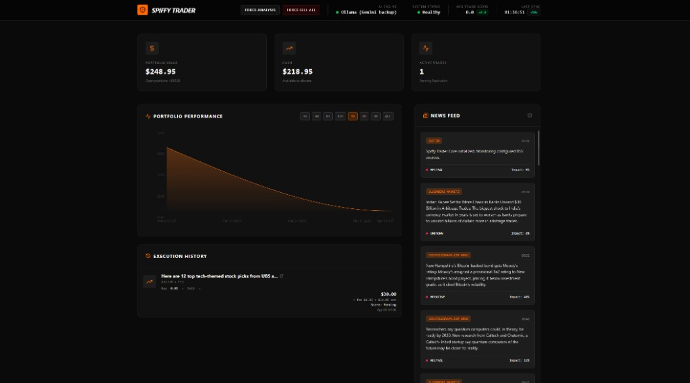

# Spiffy Trader

<p align="left">
  <a href="https://github.com/MichaelJ43/spiffy-trader/actions/workflows/ci.yml"></a>
  <a href="#verification"></a>
</p>

**Spiffy Trader** is a local, **simulated** Kalshi trading assistant. It ingests financial and political headlines from RSS, matches them to **open** [Kalshi](https://kalshi.com) prediction markets using the public trade API, and uses an LLM to decide whether to open simulated positions—**without placing real orders** or requiring Kalshi trading credentials.

## What it does

- **RSS pipeline** — Polls feeds you configure (a built-in seed list plus sources the model may discover) and stores items in a local database.
- **Market curation** — For each headline, narrows to relevant open markets using embeddings when [Ollama](https://ollama.com) is available, or token overlap as a fallback.
- **LLM decisions** — Ollama is the primary path; optional **Gemini** can back up generation. The model returns structured JSON: a short **scratchpad** (headline fit, fees/cash, **why not trading** when skipping), separate **relevance** and **edge** scores (0–100), optional **same narrative / new fact** labeling when overlapping headlines exist, plus trade/sentiment/reasoning. **Impact** in the UI is a **relevance-heavy blend** (70% relevance, 30% edge) so it stays closer to the old headline-importance scale; **edge** alone is often low when a story is priced in. Related items can include the **prior simulated decision** (pass vs trade and summary) so follow-up headlines reuse context. Prompts stress capital preservation and fees.
- **Simulated execution** — Fills at the current YES mid from Kalshi data, applies an estimated taker-style fee, and tracks P&L and settlement in the sim. If portfolio value effectively hits zero, background work pauses until you fund the sim again and resume.
- **Optional Kalshi WebSocket** — If you set `KALSHI_ACCESS_KEY_ID` and a private key (`KALSHI_PRIVATE_KEY_PATH` or `KALSHI_PRIVATE_KEY_PEM`), the app subscribes to ticker updates for **OPEN** positions and **active `market_watchlist` rows** (union capped by `KALSHI_WS_MAX_SUBSCRIBED_TICKERS`; positions win when over the cap). Use the same Kalshi environment for REST and WS (see `.env.example`). This does not place real orders; it feeds mids into snapshots for the sim.

## What you see in the UI

<p align="center">
  
</p>

- Portfolio value and cash, with open YES positions marked to mids when snapshots exist.
- A performance chart (replay-style) over selectable windows.
- Execution history with links to the Kalshi site for comparison.
- **News sidebar** — sentiment plus **Impact** (70/30 relevance–edge blend; see LLM bullet) and, when present, **Rel · Edge** breakdown.

- **Force Analysis** (run a monitoring pass early) and **Force sell all** (close simulated positions at mid or settlement where applicable).

In-app **Documentation** (same content as `src/components/DocumentationPage.tsx`) expands on fees, risk, and limitations.

## Stack and data

- **Kalshi** — Read-only use of the public markets API (listings and quotes). No order API; **this is not live trading.**
- **CouchDB** — Local state (trades, news, bot status, RSS sources, cached open Kalshi markets, **market_watchlist**). Point `COUCHDB_URL` (and credentials) at your instance; defaults match a typical local setup. With **Docker Compose**, CouchDB uses a **named volume** (not a folder in the repo) so the database files live on Docker’s Linux filesystem—safer than bind-mounting a Windows path, which often causes CouchDB sync/corruption issues. Optional **reference** JSON for Couch layout and entity sketches: `src/db/local-db-config.json`, `src/db/local-db-blueprint.json` (not loaded at runtime—see `src/db.ts` for live config).
- **Ollama** — Generation and optional embeddings (`OLLAMA_MODEL`, `OLLAMA_EMBED_MODEL`, etc.). See `.env.example` for common variables.

Models can be wrong; the UI is for experimentation and learning, **not** financial advice.

## Verification

| What it proves | Command | Passing looks like |
|----------------|---------|-------------------|
| TypeScript compiles | `npm run lint` | `tsc --noEmit` exits with code 0 (no output on success). |
| Vitest suite | `npm run test` | Last lines include `Test Files … passed` and `Tests … passed`; exit code 0. |
| Coverage run | `npm run test:coverage` | Same as tests, plus a `% Coverage report` table; exit code 0. |
| **All of the above (same order as CI)** | `npm run verify` | Runs `lint` → `test` → `test:coverage`; all must exit 0. |

The [CI workflow](.github/workflows/ci.yml) runs the same steps as `npm run verify` on every push and pull request to `main` or `master`. The badge above reflects the latest run on the default branch; add `?branch=main` to the badge URL if you need to pin a branch.

## Run locally

**Prerequisites:** Node.js, a running **CouchDB** instance, and **Ollama** (with your chosen chat and, if you want semantic matching, embedding models pulled). Optional: `GEMINI_API_KEY` for Gemini as a backup to Ollama.

1. Install dependencies: `npm install`
2. Copy `.env.example` to `.env.local` and set at least CouchDB URL/credentials, Ollama settings, and optionally `GEMINI_API_KEY`.
3. Run the app: `npm run dev` (serves on port 3000 by default).

### Docker Compose

Run the full stack (app, CouchDB, Ollama) with:

`docker compose --env-file .env.local up --build`

CouchDB data is stored in the `couchdb_data` **named volume**, not `./local-db`. That avoids exposing the active database directory through a host bind mount (a common cause of corruption on Docker Desktop for Windows).

**Backups** (optional): snapshot the volume when containers are stopped, e.g. from the repo directory (volume name is usually `{folder}_couchdb_data` for this repo’s folder name; confirm with `docker volume ls`):

```powershell
docker run --rm -v spiffy-trader_couchdb_data:/data -v "${PWD}:/out" alpine tar czf /out/couchdb-backup.tgz -C /data .
```

If your Compose project name differs, replace `spiffy-trader_couchdb_data` with the name shown for `couchdb_data`.

**If CouchDB returns 500s / `enoent` in logs** (often after a bad shutdown), stop the stack, remove the `couchdb_data` named volume, and run `docker compose up` again so Couch can re-init empty. That wipes local Couch data in that volume.
